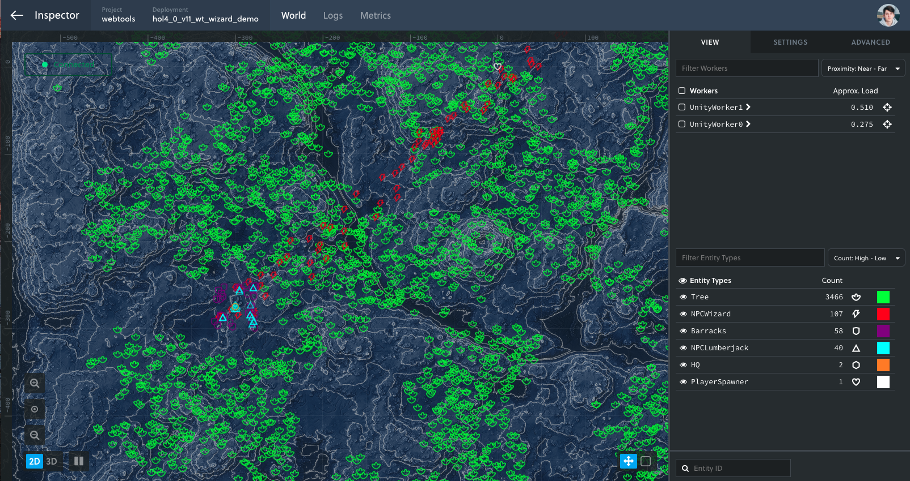

# Inspector Map Overlay

A Chrome extension that overlays your game map over the Inspector viewport.

**Note: This is an experimental feature, created as a proof of concept. As such we cannot promise to support it, or guarantee that it will work in the future. If you would like to see this functionality as part of the Inspector, or have any other feedback, please take a few minutes to [fill in this form](https://goo.gl/forms/jWNcIhohgaUn1W5w2).**

## Features

* Utilise an image stored locally (in Chrome)
* Automatically scales your image to match your game world's boudaries
* Support for large images (> 20MB)
* Works for both local and cloud Inspector

## Install for Mac, Linux, ChromeOS
* Download `dist.crx` from the [releases page.](https://github.com/improbable/inspector-map-overlay/releases)
* Install the extension by dragging the file while navigated to `chrome://extensions`
* Review and accept the permissions to complete installation

## Install for Windows
* Download and unzip `dist-win.zip` from the [releases page.](https://github.com/improbable/inspector-map-overlay/releases)
* Install the extension by navigating to `chrome://extensions`, turning on Developer Mode and loading the folder with `Load Unpacked Extension`
* Review and accept the permissions to complete installation

## Usage
* Click on the icon in the Chrome toolbar, and select an image
* **The map will render once you interact with the viewport (e.g drag or zoom).**
